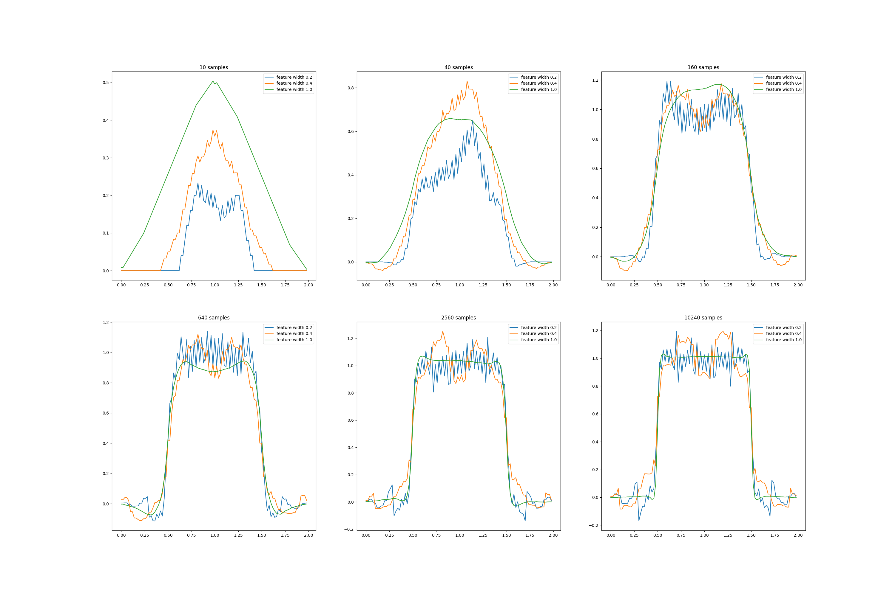

# 🧠 Coarse Coding

This repository explores **coarse coding** concepts from reinforcement learning — particularly applied to signal representation and function approximation.

---

## 📂 Project Structure

```
coarse-coding/
│
├── 📁 book_images/           # Original figures from reference material
│   └── Figure_9_8.PNG
│
├── 📁 generated_images/      # Images generated by the code
│   └── figure_9_8.png
│
├── 📁 notebooks/             # Jupyter notebooks for experimentation
│   └── square_wave.ipynb
│
└── 📁 src/                   # Python source files
    ├── __init__.py           # Package initializer
    ├── classes.py            # Contains main class implementations
    └── square_wave.py        # Implements square wave generation and visualization
```

---

## ⚙️ Setup Instructions

1. Clone the repository:
   ```bash
   git clone https://github.com/YourUsername/coarse-coding.git
   cd coarse-coding
   ```

2. (Optional) Create and activate a virtual environment:
   ```bash
   python -m venv venv
   source venv/bin/activate     # For macOS/Linux
   venv\Scripts\activate        # For Windows
   ```

3. Install required dependencies:
   ```bash
   pip install -r requirements.txt
   ```

---

## 📘 Description

This project focuses on:
- Implementing **coarse coding** methods for representing continuous features.
- Visualizing **square wave** examples.
- Reproducing figures from reinforcement learning textbooks (e.g., *Sutton & Barto, Reinforcement Learning: An Introduction*).

The `notebooks/square_wave.ipynb` file provides an interactive visualization of the process, while `src/classes.py` and `src/square_wave.py` handle the computational and visualization logic.

---

## 🖼️ Example Output

Example figure generated by the project:

<p align="center">
  
</p>

---

## 🧩 Author

**Emilia Nahapetyan**  
🎓 National Polytechnic University of Armenia  
💡 Focus: Reinforcement Learning & Function Approximation

---

## 🏛️ License

This project is licensed under the MIT License — feel free to use and modify it.

---

⭐ *If you find this project useful, give it a star!*
