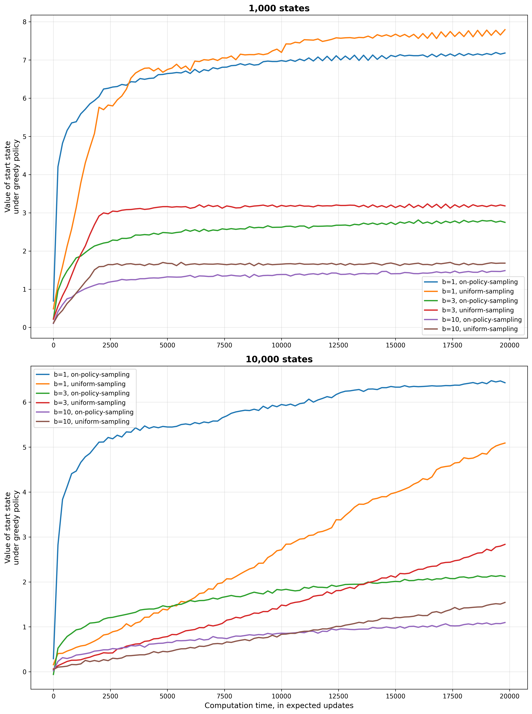

# 🧭 Trajectory Sampling

This repository demonstrates **trajectory sampling** methods used in reinforcement learning — focusing on how agents generate and evaluate experience trajectories to estimate value functions and improve policies.

---

## 📂 Project Structure

```
trajectory-sampling/
│
├── 📁 book_images/             # Reference figures from the textbook
│   ├── Figure_8_8_1.PNG
│   └── Figure_8_8_2.PNG
│
├── 📁 generated_images/        # Figures generated by the code
│   └── figure_8_8.png
│
├── 📁 notebooks/               # Jupyter notebooks for experiments
│   └── trajectory_sampling.ipynb
│
└── 📁 src/                     # Python source code
    ├── __init__.py             # Package initializer
    └── trajectory_sampling.py  # Core implementation for trajectory sampling
```

---

## ⚙️ Setup Instructions

1. Clone the repository:
   ```bash
   git clone https://github.com/YourUsername/trajectory-sampling.git
   cd trajectory-sampling
   ```

2. (Optional) Create and activate a virtual environment:
   ```bash
   python -m venv venv
   source venv/bin/activate     # For macOS/Linux
   venv\Scripts\activate      # For Windows
   ```

3. Install dependencies:
   ```bash
   pip install -r requirements.txt
   ```

---

## 📘 Description

This project explores:
- **Monte Carlo trajectory sampling** for estimating returns.
- Understanding the relationship between episodes and value function approximation.
- Reproducing key examples from *Sutton & Barto, Reinforcement Learning: An Introduction (2nd Edition)*, particularly Chapter 8.

The `notebooks/trajectory_sampling.ipynb` provides visualization and experimentation tools, while `src/trajectory_sampling.py` contains the main implementation.

---

## 🖼️ Example Output

Example figure generated by the project:

<p align="center">
  
</p>

---

## 🧩 Author

**Emilia Nahapetyan**  
🎓 National Polytechnic University of Armenia  
💡 Focus: Reinforcement Learning — Monte Carlo and Temporal-Difference Learning

---

## 🏛️ License

This project is licensed under the MIT License — feel free to use, modify, and share it.

---

⭐ *If you find this project helpful, please give it a star!*
